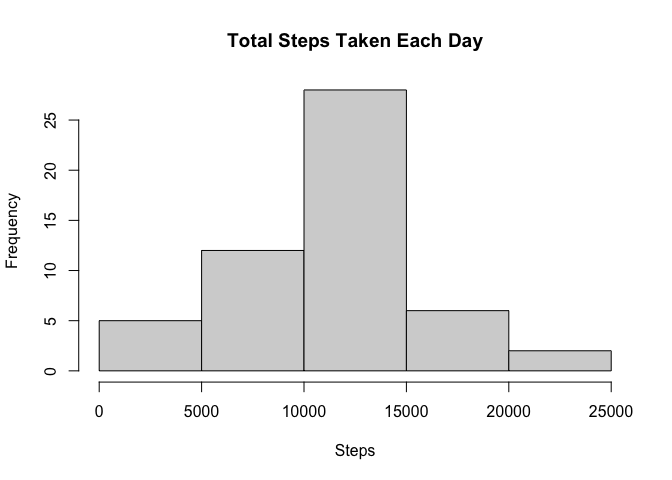
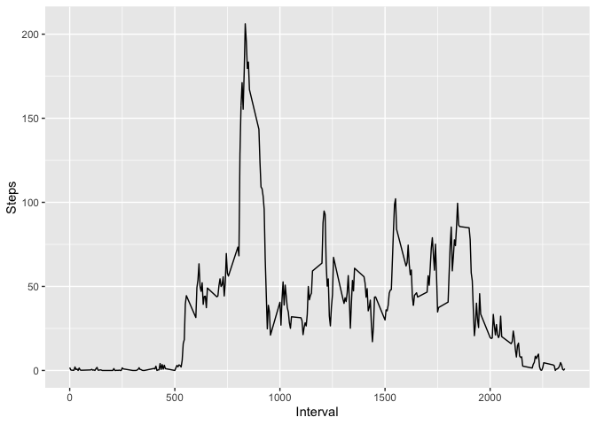
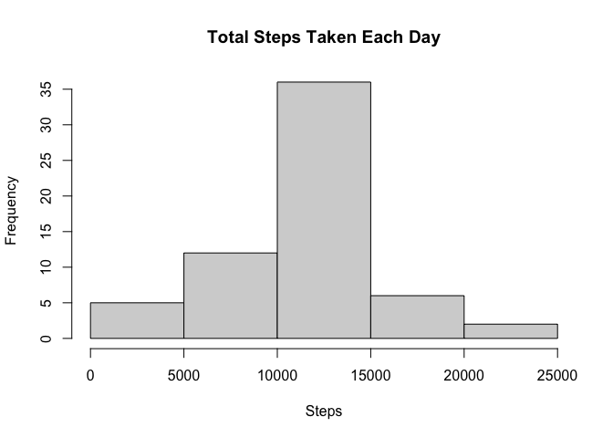
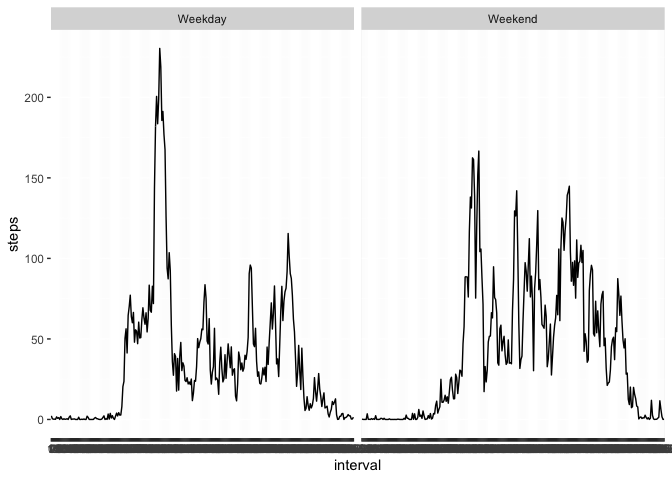

## Loading and preprocessing the data  

```r
library(lubridate)
```

```
## 
## Attaching package: 'lubridate'
```

```
## The following objects are masked from 'package:base':
## 
##     date, intersect, setdiff, union
```

```r
unzip("activity.zip")
data <- read.csv("activity.csv")
data$date <- ymd(data$date)
```
## What is mean total number of steps taken per day?  

```r
data$date <- factor(data$date)
sumsteps <- aggregate(data$steps ~ data$date, FUN = sum)
names(sumsteps) <- c("Date", "Steps")
hist(sumsteps$Steps, main = "Total Steps Taken Each Day", xlab = "Steps")
```

<!-- -->

```r
totalmean <- mean(sumsteps$Steps)
totalmean
```

```
## [1] 10766.19
```

```r
totalmedian <- median(sumsteps$Steps)
totalmedian
```

```
## [1] 10765
```
## What is the average daily activity pattern?  

```r
library(ggplot2)
intervalsteps <- aggregate(data$steps ~ data$interval, FUN = mean, na.rm = TRUE)
names(intervalsteps) <- c("Interval", "Steps")
ggplot(data = intervalsteps, aes(x=Interval, y=Steps)) + geom_line()
```

<!-- -->

```r
intervalsteps[which.max(intervalsteps$Steps),]
```

```
##     Interval    Steps
## 104      835 206.1698
```
## Imputing missing values  

```r
nas <- data[is.na(data$steps),]
nrow(nas)
```

```
## [1] 2304
```

```r
for (i in 1:nrow(nas)){
        tmp_interval <- nas[i,"interval"]
        tmp_mean <- intervalsteps[intervalsteps$Interval==tmp_interval,"Steps"]
        nas[i,"steps"] <- tmp_mean
}

filled.data <- data
nasvec <- setNames(nas$steps, rownames(nas))
filled.data[rownames(nas), "steps"] <- nasvec

sumsteps_final <- aggregate(filled.data$steps ~ filled.data$date, FUN = sum)
names(sumsteps_final) <- c("Date", "Steps")
hist(sumsteps_final$Steps, main = "Total Steps Taken Each Day", xlab = "Steps")
```

<!-- -->

```r
finalmean <- mean(sumsteps_final$Steps)
finalmean
```

```
## [1] 10766.19
```

```r
finalmedian <- median(sumsteps_final$Steps)
finalmedian
```

```
## [1] 10766.19
```
Imputing the missing values causes no changes, because the imputed values are the small parts of the mean. (sorry for bad expression)
## Are there differences in activity patterns between weekdays and weekends?

```r
filled.data$day <- weekdays(as.Date(filled.data$date))

for (i in 1:nrow(filled.data)){
        ifelse(filled.data[i,"day"] == "Saturday"|
                filled.data[i,"day"] == "Sunday", 
                filled.data[i,"day"] <- "Weekend", 
                filled.data[i,"day"] <- "Weekday")
}

filled.data$day <- factor(filled.data$day)
filled.data$interval <- factor(filled.data$interval)

weeksteps <- aggregate(steps~interval+day, filled.data, mean)

ggplot(data=weeksteps, aes(interval,steps, group = 1)) + geom_line() + facet_grid(rows = ~day)
```

<!-- -->
